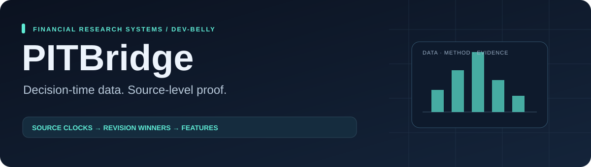

# PITBridge

**Financial features as they were known when a decision was made.**

[](https://github.com/dev-belly/PITBridge/actions/workflows/ci.yml)
[Open the online report](https://dev-belly.github.io/PITBridge/) · [中文说明](README.zh-CN.md) · [Methodology](docs/METHODOLOGY.md) · [Data contract](docs/DATA_CONTRACT.md) · [Interview notes](docs/INTERVIEW.md)

An invoice dated January can be published in February, arrive in March, and be corrected later. Joining on January's date alone can put future knowledge into an earlier credit decision. PITBridge resolves **event time, publication time, ingestion time and observation revisions** before exporting a feature snapshot.


## Run in one minute

```bash
git clone https://github.com/dev-belly/PITBridge.git
cd PITBridge
python -m pip install -e .
pitbridge demo --out outputs
pitbridge verify --out outputs
python -m unittest discover -s tests -v
```

Open `outputs/report.html` in a browser. The report is self-contained, works offline and includes a filter for changed selections. Python 3.11+; **no third-party runtime dependencies**.

```bash
# Bring your own observations, decisions and feature specs:
pitbridge build --inputs demo/inputs.json --out outputs
```

## What the saved example proves

The deliberately small synthetic fixture is hand-auditable: **11 observations, 15 decisions, 45 feature lookups** across tax, bank and utility sources.

| Saved result | Count | Interpretation |
| :--- | ---: | :--- |
| Unsafe selections using future knowledge | 11 | The event-only baseline selected a record unavailable at decision time. |
| Selections changed by the full contract | 16 | Includes freshness and tombstone effects as well as future knowledge. |
| Selected / missing feature rows | 16 / 29 | Missingness is preserved with a reason, never silently replaced by zero. |

Inspect [the comparison](demo/comparison.csv), [record-level lineage](demo/snapshots.csv), [normalized inputs](demo/inputs.json), and [summary](demo/summary.json). These counts demonstrate the fixture; they are not a population leakage rate.

## Selection contract

1. Require `event_at <= decision_at` and `max(published_at, ingested_at) <= decision_at`.
2. For each entity/source/feature/event, select the **highest known revision**, even if a lower revision arrives later.
3. Apply known tombstones to that event. Do not resurrect its earlier revision.
4. Select the latest remaining event within the feature's inclusive freshness window.
5. Preserve a row for every decision/spec pair, including `no_history`, `not_available`, `deleted` and `stale`.

The production path is a SQLite window-function join. A separate Python enumerator checks its results, including randomized histories and append-future invariance. [Read the implementation](src/pitbridge/core.py).

## Evidence you can replay

| Artifact | Purpose |
| :--- | :--- |
| `inputs.json` | Canonical, normalized source records, decisions and feature contracts. |
| `snapshots.csv` | Values, missingness, selected record IDs, revisions and timestamps. |
| `comparison.csv` | Explicitly unsafe event-only baseline; never used as training features. |
| `summary.json`, `report.html` | Derived counts and an offline inspection report. |
| `manifest.json` | SHA-256 hashes of all five artifacts. |

Verification checks hashes **and** reruns both algorithms, rejecting a fabricated summary even if its hash was updated. Hashes are not signatures and cannot establish that an external source is truthful.

## Availability-aware rolling features

Rolling sums, observation means and counts resolve availability, revisions
and tombstones before aggregating an inclusive event-time window. Every result
retains all contributing records; a separate Python temporal enumerator checks
membership and values.

```bash
pitbridge rolling-demo --out outputs/rolling
pitbridge verify-rolling --out outputs/rolling
pitbridge aggregate --inputs demo/rolling/inputs.json --out outputs/custom
```

[Online rolling case](https://dev-belly.github.io/PITBridge/rolling/) ·
[Contract and worked example](docs/ROLLING.md) ·
[Feature rows](demo/rolling/features.csv) · [Membership](demo/rolling/members.csv)

## Verified downstream integration

PITBridge is also exercised by a real downstream adapter in
[CreditVintage](https://github.com/dev-belly/CreditVintage). The published
[PITBridge × CreditVintage explorer](https://dev-belly.github.io/CreditVintage/lineage/)
traces each held-out model feature back to the selected PITBridge source record,
revision, publication time, ingestion time and decision cutoff. The downloadable
[evidence bundle](https://dev-belly.github.io/CreditVintage/lineage/evidence.zip)
contains the source events, exported model inputs, predictions and manifests.

The default synthetic integration contains **480 applications, 1,440 selected
features and 120 held-out predictions**. Its source fixture includes **192
observations that were not yet available at their decision time**, so the
adapter has to preserve PITBridge's availability contract instead of performing
a plain event-date join. CreditVintage currently pins PITBridge commit
`ed19dc698534f45a2b646fb4976ff6b01966b0cc`; its CI verifies the PITBridge
bundle with both the SQL engine and independent Python oracle before rebuilding
the downstream model evidence.

This is a downstream integration, not a claim that the two repositories form a
production banking platform. The full adapter contract, units, UTC convention
and replay boundaries live in
[CreditVintage's lineage documentation](https://github.com/dev-belly/CreditVintage/blob/main/docs/LINEAGE.md).

## Scope

This is a reference implementation for scalar financial observations and explicit rolling aggregates. It does not provide streaming ingestion, access control or label generation. Version numbers and trustworthy availability timestamps must come from the upstream source contract. SQLite is intentionally inspectable; distributed-scale performance has not been benchmarked. Rolling means are observation means, and counts do not establish complete business activity.

PITBridge remains independently usable, while CreditVintage provides a
published, CI-verified downstream source-to-prediction integration. MIT license.
