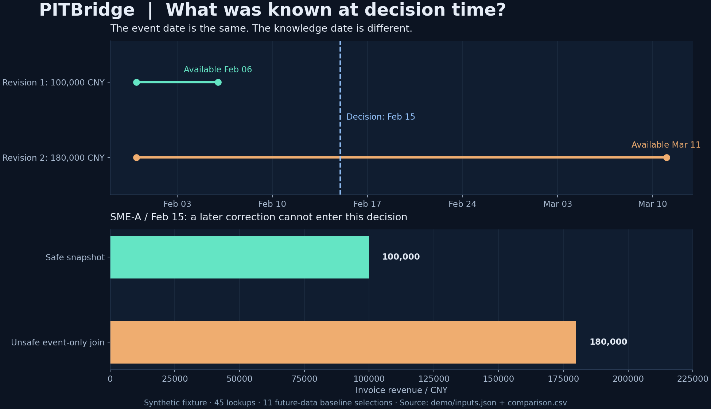

# PITBridge｜金融时点数据与版本溯源

**核心问题：做出信贷决策时，银行当时到底能看到哪个版本的数据？**

[先试一张发票](examples/README.md#a-correction-that-arrives-later) · [从 CSV 表格开始](examples/README.md#optional-pandascsv-input) · [在线报告](https://dev-belly.github.io/PITBridge/) · [提交试用反馈](https://github.com/dev-belly/PITBridge/issues/new?template=trial_feedback.md)

例如，一月份开票金额在二月份公开、三月份才进入银行系统，四月份又被修订。直接按照“一月份”去关联历史申请，会把后来的信息放进早期特征，导致回测过于乐观。

PITBridge 同时处理数据发生时间、公开时间、入库时间和修订版本；以 SQLite SQL 生成特征，用独立 Python 枚举结果核验，并保留每一个特征的来源记录。



## 快速运行

需要 Git 和 Python 3.11 或更高版本。下面是 Windows PowerShell 命令，使用独立环境，无需先激活：

```powershell
git clone https://github.com/dev-belly/PITBridge.git
cd PITBridge
python -m venv .venv
.\.venv\Scripts\python.exe -m pip install -e .
.\.venv\Scripts\python.exe -m pitbridge demo --out outputs
.\.venv\Scripts\python.exe -m pitbridge verify --out outputs
.\.venv\Scripts\python.exe examples/decision_time.py
```

Linux / macOS 用 `python3 -m venv .venv` 创建环境，并将上述 `.\.venv\Scripts\python.exe` 换成 `.venv/bin/python`；完整命令见[英文快速运行](README.md#run-in-one-minute)。

打开 `outputs/report.html` 即可查看离线报告。无第三方运行依赖，安装与示例在 Linux 和 Windows CI 中检查。
仓库用 `.gitattributes` 保留 LF 换行；Windows Git 开启 `core.autocrlf=true` 时，已保存的快照和滚动报告也保持原哈希。

## 可直接复用的 Python 案例

[decision_time.py](examples/decision_time.py) 用两个版本的合成开票记录，展示同一个一月份业务时点在不同决策日的结果：

| 决策日（UTC） | 合成开票收入（元） | 选择的记录 |
| :--- | ---: | :--- |
| 2 月 1 日 | 缺失：尚未可用 | 无 |
| 2 月 15 日 | 100,000 | `invoice-v1` |
| 4 月 15 日 | 135,000 | `invoice-v2` |

原始记录 2 月 6 日才可用，修订记录 4 月 3 日才可用；不能把四月份的修订带回二月份。
脚本直接调用 `build_snapshot`，并用独立 Python 枚举核对结果；替换其中的源记录、决策和字段规则即可试用自己的数据。[完整说明](examples/README.md)。

## 从 CSV 表格试用

已经有表格时，可运行已合并的 pandas 适配示例。pandas 单独安装，核心包不依赖它：

```powershell
.\.venv\Scripts\python.exe -m pip install "pandas>=2,<4"
.\.venv\Scripts\python.exe examples/pandas_csv.py
```

示例读取 `examples/csv/` 的三份合成表格，输出同样的三条记录：尚未可用、`invoice-v1`（100,000）、`invoice-v2`（135,000）。它保留有时区的时间、整数修订、撤销标记和显式缺失，并逐字段与独立 Python 实现核对；不把缺失值填成零。[字段规则和替换自己的表格](examples/README.md#optional-pandascsv-input)。

试用后可[反馈卡住的步骤或实际选择结果](https://github.com/dev-belly/PITBridge/issues/new?template=trial_feedback.md)，帮助补充适配器、文档和反例。

## 已实现的重点

- **防止未来信息泄漏：** 数据发生时间与真正可用时间都必须不晚于申请时间。
- **正确处理修订：** 选择当时已知的最高版本；迟到的旧版本不会覆盖新版本。
- **撤销与过期：** 撤销记录只影响对应观察时点，不能重新使用该记录旧版本；特征可配置有效天数。
- **显式缺失：** 区分没有历史、尚未可用、已撤销和已过期，保留申请行。
- **逐条溯源：** 导出来源、记录 ID、版本、发生时间、公开时间与入库时间。
- **可重放证据：** 修改报告并更新哈希，仍会被语义重放发现。
- **时点滚动统计：** 在选择当时已知版本后，计算指定窗口的加总、观察均值和计数，并保留每条贡献记录；SQL 与 Python 分别重放成员与数值。

[在线滚动特征案例](https://dev-belly.github.io/PITBridge/rolling/) · [窗口合同与手算案例](docs/ROLLING.md)

```powershell
.\.venv\Scripts\python.exe -m pitbridge rolling-demo --out outputs/rolling
.\.venv\Scripts\python.exe -m pitbridge verify-rolling --out outputs/rolling
```

合成示例有 11 条源记录、15 次决策、45 次特征查询。错误的“只按发生时间关联”基线有 11 次使用未来信息；完整规则共改变 16 次选择。后者还包括撤销和过期影响，不能把两个数字混为一谈。

## 已验证的下游集成

PITBridge 现在不仅是独立演示组件，也被
[CreditVintage](https://github.com/dev-belly/CreditVintage) 的真实适配器代码路径调用。
公开的 [PITBridge × CreditVintage 溯源页面](https://dev-belly.github.io/CreditVintage/lineage/)
可以从留出集预测一路追到每个模型特征对应的源记录、修订版本、公开时间、入库时间和决策截止时点；
[完整证据包](https://dev-belly.github.io/CreditVintage/lineage/evidence.zip)
同时包含源事件、导出的模型输入、预测结果和 manifest。

默认合成集成案例包含 **480 个申请、1,440 个已选择特征和 120 个留出集预测**，
其中源数据里有 **192 条记录在对应决策时点尚不可用**。因此下游不能只按业务发生日期直接关联，
而必须保留 PITBridge 的可用性和版本规则。CreditVintage 当前固定使用 PITBridge
`ed19dc698534f45a2b646fb4976ff6b01966b0cc`，CI 会先用 SQL 引擎和独立 Python oracle
重放 PITBridge 证据，再重建后续模型证据。

这证明的是一条可重放的“源数据 → 时点特征 → 模型输入 → 预测”研究链路，不代表真实银行生产系统。
完整单位、UTC 约定和适配边界见
[CreditVintage 的 LINEAGE 文档](https://github.com/dev-belly/CreditVintage/blob/main/docs/LINEAGE.md)。

[方法与规则](docs/METHODOLOGY.md) · [输入字段](docs/DATA_CONTRACT.md) · [中文面试问答及简历表述](docs/INTERVIEW.md)

这是可以核验的金融数据工程研究组件。演示数据全部为合成；没有宣称接入真实银行、降低实际违约率或处理生产规模数据。

## 反馈与贡献

[可直接分享的中英案例介绍](docs/SHARE.md)包含反例结果、运行命令、源码和试用反馈入口。

运行失败或发现选错记录时，欢迎[提交包含最小合成案例的 issue](https://github.com/dev-belly/PITBridge/issues/new/choose)。
[贡献指南](CONTRIBUTING.md)列出实现与回归位置、运行命令和核验要求，欢迎补充反例、可选适配示例和文档。
如果这套方法对你有用，可以点 Star 留作以后查阅。
